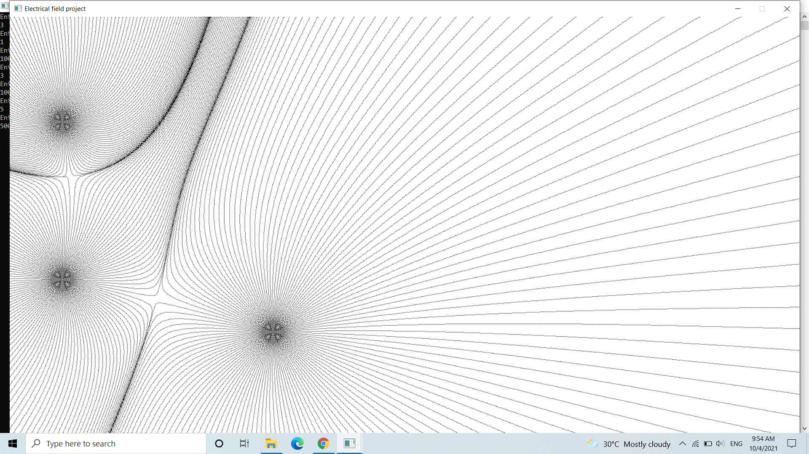
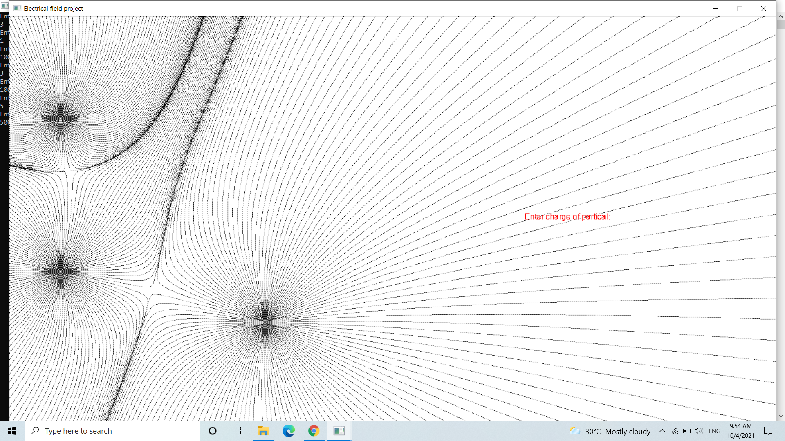
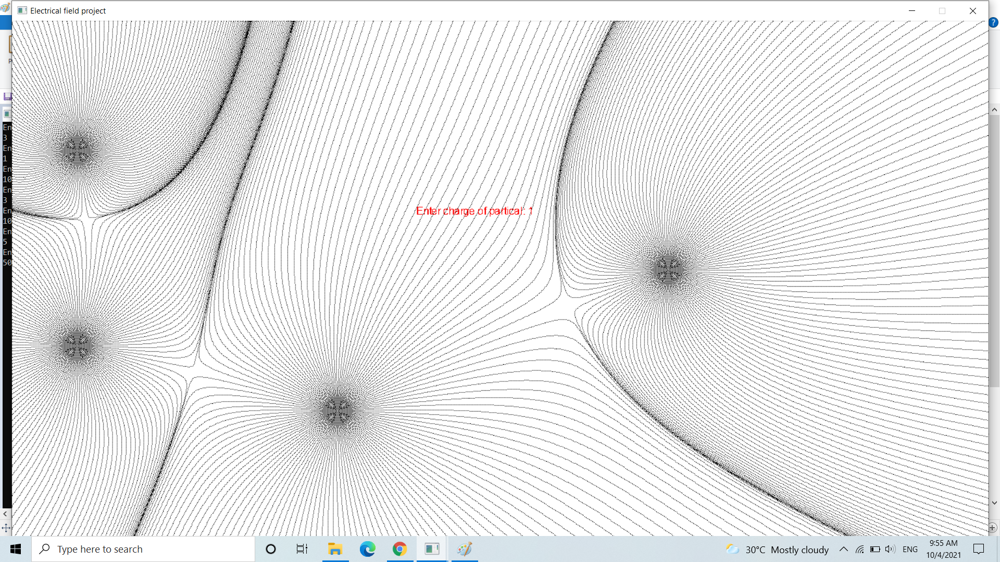
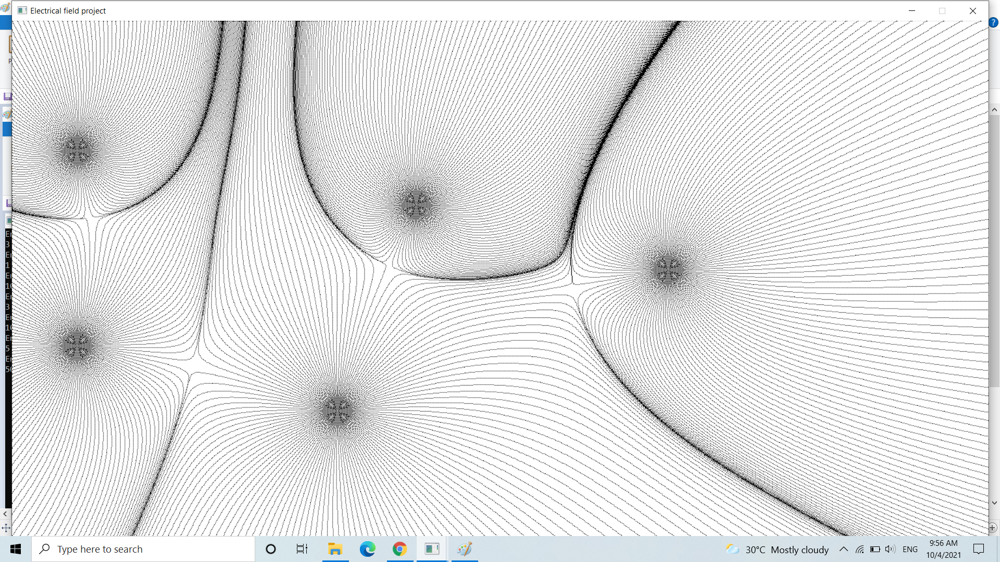

# Electrical-Field-Project
A software simulate the electrical field of less than 10 charges. I have tried my best to improve UI/UX. The software have some user interface function such as adding charges by double click on screen.\
To Initiate the Screen, we enter number of the charges and value of charge in unit(Coubloumb) and the position of the charge in term of ("x y") in pixel unit.

Then, a electrical field screen will appear upon pressing enter

Double click to add more charge at mouse cursor

Enter the value of new charge

After adding new charge

